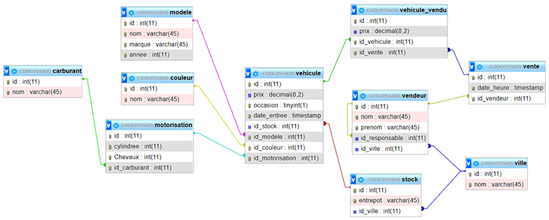

# Projet JPA Spring Boot Démo



[Voir les explications et le cours correspondant](https://pbouget.github.io/cours/framework-back/jpa-generation-entities/)

Pour ce projet de démonstration, pensez à créer la BD *concession* sous MySQL et exécuter le fichier *concession.sql*.

Vous devez juste importer le projet dans Eclipse, faire un refresh des dépendances Gradle et lancez Spring Boot App.

## Contenu du projet

### Dans *Gradle*

```java
	dependencies {
		implementation 'org.springframework.boot:spring-boot-starter-data-jpa'
		implementation 'org.springframework.boot:spring-boot-starter-web'
		developmentOnly 'org.springframework.boot:spring-boot-devtools'
		runtimeOnly 'mysql:mysql-connector-java'
		implementation group: 'io.springfox', name: 'springfox-boot-starter', version: '3.0.0'
		testImplementation 'org.springframework.boot:spring-boot-starter-test'
	}
```

### Dans *application.properties*

```java
	# gestion BD MySQL
	spring.datasource.url=jdbc:mysql://localhost:3306/concession?useSSL=false&serverTimezone=CET
	spring.datasource.username=test
	spring.datasource.password=test
	spring.datasource.driver-class-name=com.mysql.cj.jdbc.Driver

	# JPA/Hibernate
	spring.jpa.show-sql=true
	spring.jpa.hibernate.ddl-auto=none  /// Important ///
	spring.jpa.properties.hibernate.dialect = org.hibernate.dialect.MySQL5InnoDBDialect

	# Swagger
	spring.mvc.pathmatch.matching-strategy = ANT_PATH_MATCHER
```

### Configuration de Swagger

Ajout de la classe SwaggerConfig :

```java

		package fr.bouget.jpa;

		import org.springframework.context.annotation.Bean;
		import org.springframework.context.annotation.Configuration;

		import springfox.documentation.builders.ApiInfoBuilder;
		import springfox.documentation.builders.PathSelectors;
		import springfox.documentation.builders.RequestHandlerSelectors;
		import springfox.documentation.service.ApiInfo;
		import springfox.documentation.spi.DocumentationType;
		import springfox.documentation.spring.web.plugins.Docket;


		@Configuration
		public class SwaggerConfig {

			@Bean
			public Docket api() {

				return new Docket(DocumentationType.OAS_30)
						.apiInfo(apiEndPointsInfo())
						.select()
						.apis(RequestHandlerSelectors.any())
						.paths(PathSelectors.any())
						.build();
			}

			private ApiInfo apiEndPointsInfo() {

				return new ApiInfoBuilder().title("JPA-Entities-From-Tables REST API")
						.license("Apache 2.0")
						.licenseUrl("http://www.apache.org/licenses/LICENSE-2.0.html")
						.version("1.0-SNAPSHOT")
						.build();
			}
		}
```

### CouleurRepository

```java
@Repository
public interface CouleurRepository extends JpaRepository<Couleur, Integer> {
}
```

### CouleurController

```java	
		@RestController
		@CrossOrigin("*")
		@RequestMapping("/couleur")
		public class CouleurController {
			
			@Autowired
			CouleurRepository couleurRepository;
			
			@GetMapping("/all")
			public List<Couleur> findAll()
			{
				return couleurRepository.findAll();
			}

		}
```

### *Run as Spring Boot App* et voir avec navigateur & swagger

[Lien avec Swagger](http://localhost:8080/swagger-ui/index.html)

[Lien avec navigateur](http://localhost:8080/couleur/all)

Et voilà !

[Retour vers le cours complet](https://pbouget.github.io/cours/)